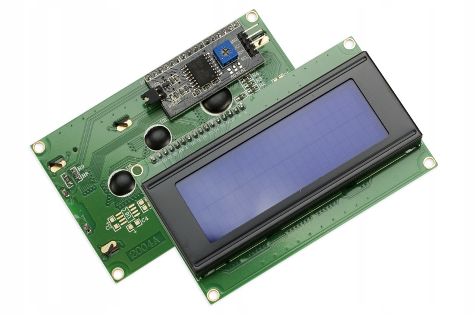
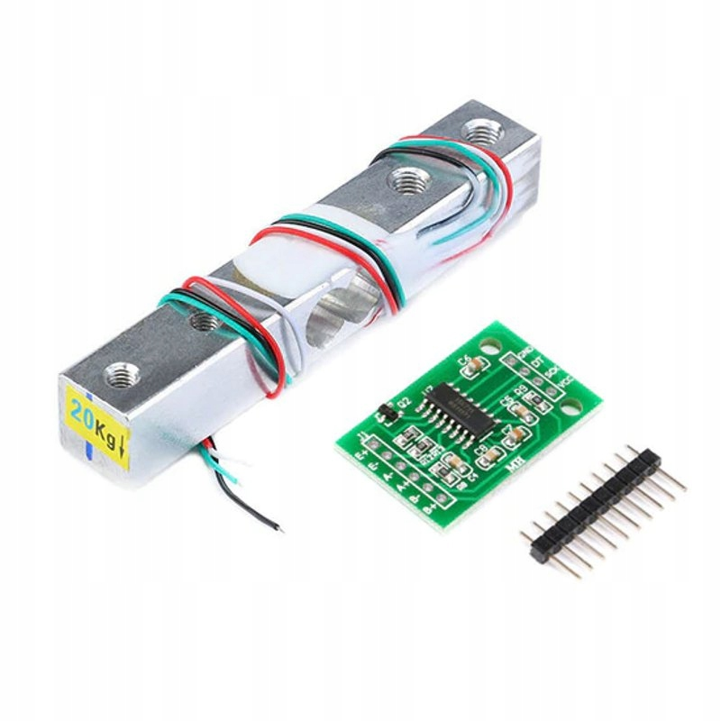
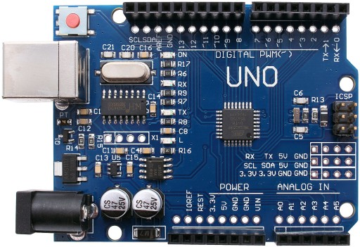
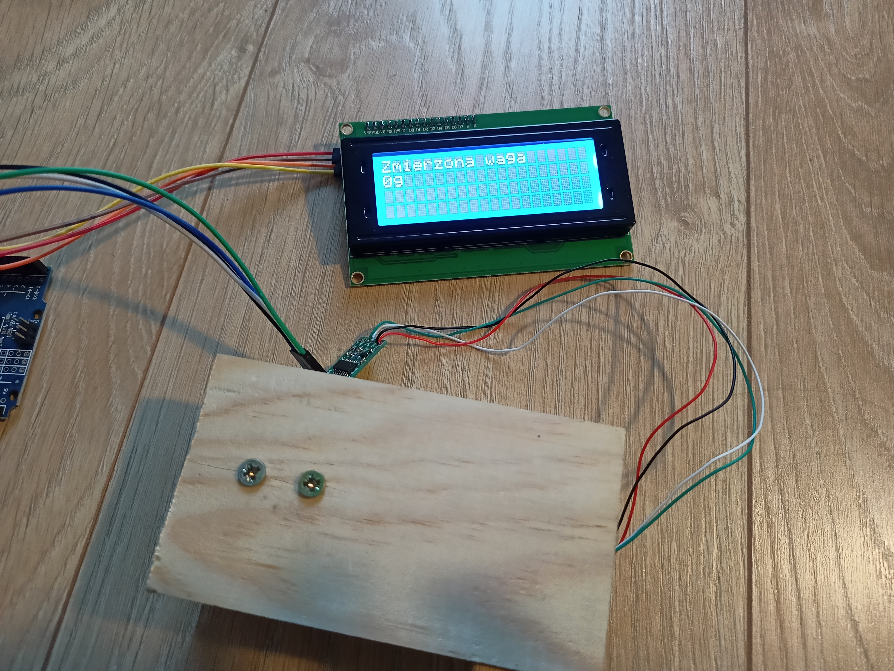
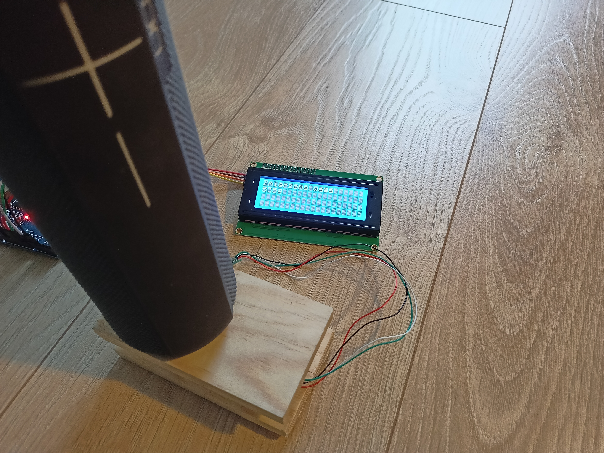

# Projekt

# #Wyświetlanie wagi przedmiotów na ekranie LCD.


## Opis

Zamysłem projektu jest pomiar wagi przedmiotów oraz wyświetlanie jej na wyświetlaczu LCD.

## Elementy

* Wyświetlacz LCD 20x4 z konwerterem I2C
* Belka tensometryczna + moduł HX711 (tensometr)
* Płytka arduino UNO


## Links

https://botland.com.pl/wyswietlacze-alfanumeryczne-i-graficzne/2640-wyswietlacz-lcd-4x20-znakow-niebieski-konwerter-i2c-lcm1602-5904422331061.html?utm_source=skapiec&utm_medium=pricewars2&utm_campaign=wyswietlacz-lcd-4x20-znakow-niebieski-konwerter-i2c-lcm1602



https://allegro.pl/oferta/modul-hx711-tensometr-belka-tensometryczna-20kg-8277006903?snapshot=MjAyMi0wMS0wOVQyMDowNzoyOS45ODFaO2J1eWVyO2JhOTAyYTUzZmJiZTIzMWFkZjdjZWIyZTUzYmI3MjA4YWZjYjU3YzBmM2I0ZDEzNjEwOGU0MzJhOTlmNmU4ZDA%3D



https://allegro.pl/oferta/zestaw-startowy-do-arduino-uno-r3-atmega328-ch340-10102800766  




## Budowa

Wyświetlacz LCD lutujemy z konwerterem I2C, a następnie konwerter łączymy z płytką Arduino:

GND > GND ;
VCC > 5V  ;
SDA > SDA ;
SCL > SCL ;

Następnie lutujemy belkę tensometryczną z modułem HX711:

RED   > E+
BLACK > E-
WHITE > A-
GREEN > A+

W kolejnym kroku łączymy mod HX711 z płytką Aeduino:

GND > GND
DT  > A0
SCK > A1
VCC > 5V

Belkę tensometrczyną mocujemy na drewnianych kawałkach aby uzyskać podstawę oraz miejsce do kłądzenia przedmiotów na naszej wadze. 
Po połączeniu wszyskich elementów powinniśmy uzyskac następujący efekt:


## Działanie

Po włączeniu wagi, zostaniemy poproszeni o położenie 100g na wagę w celu jej kalibracji.


Po skalibrowaniu będziemy mogli ważyć przedmioty i odczytywać ich wagę z wyświetlacza.







## KOD

```cp

#include <Wire.h> 
#include <LiquidCrystal_I2C.h>     // potrzebne biblioteki
LiquidCrystal_I2C lcd(0x27,20,4);      // deklaracja portu wyswietlacza i jego wilkosci
 
#define DT A0         // miejsca gdzie sa podlaczone piny do plytki
#define SCK A1

 
long sample=0;
float val=0;
long count=0;
 
unsigned long readCount(void)
{
unsigned long Count;
unsigned char i;
pinMode(DT, OUTPUT);
digitalWrite(DT,HIGH);
digitalWrite(SCK,LOW);
Count=0;
pinMode(DT, INPUT);
while(digitalRead(DT));
for (i=0;i<24;i++)
{
digitalWrite(SCK,HIGH);
Count=Count<<1;
digitalWrite(SCK,LOW);
if(digitalRead(DT))
Count++;
}
digitalWrite(SCK,HIGH);
Count=Count^0x800000;
digitalWrite(SCK,LOW);
return(Count);
}
 
void setup()
{
pinMode(SCK, OUTPUT);
pinMode(sw, INPUT_PULLUP);
lcd.init();   //wywolanie wyswietlacza
lcd.init();
lcd.backlight();   //zapaleniue tla wyswietlacza
lcd.print(" Waga ");       // wpisujemy co ma byc na wyswietlaczu
lcd.setCursor(0,1);
lcd.print(" Jednostka ");
delay(1000);
lcd.clear();
calibrate();
}
 
void loop()
{
count= readCount();
int w=(((count-sample)/val)-2*((count-sample)/val));
lcd.setCursor(0,0);
lcd.print("Zmierzona waga");
lcd.setCursor(0,1);
lcd.print(w);
lcd.print("g ");
 
if(digitalRead(sw)==0)
{
val=0;
sample=0;
w=0;
count=0;
calibrate();
}
}
 
void calibrate() // rozpoczęcie kalibracji wagi
{
lcd.clear();
lcd.print("Kalibracja...");
lcd.setCursor(0,1);
lcd.print("Prosze czekac...");
for(int i=0;i<100;i++)
{
count=readCount();
sample+=count;
}
sample/=100;
lcd.clear();
lcd.print("Poloz 100g&poczekaj");
count=0;
while(count<1000)
{
count=readCount();
count=sample-count;
}
lcd.clear();
lcd.print("Prosze czekac....");
delay(2000);
for(int i=0;i<100;i++)
{
count=readCount();
val+=sample-count;
}
val=val/100.0;
val=val/100.0; 
lcd.clear();
}
```